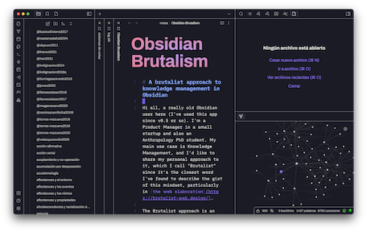

# Obsidian Brutalism

A theme based on the [web brutalist](https://brutalist-web.design/) approach. Mainly for my personal needs:

- Words are the *béton brut*, the raw material. Forget about fancy visual features, focus on writing
- Less css is always better
- Let space for native obsidian config, like accent color or font selection

## Recomendations

- Fonts: Use fonts like [Archivo font](https://fonts.google.com/specimen/Archivo) for user interface, [iA Writer Duo](https://github.com/iaolo/iA-Fonts/tree/master/iA%20Writer%20Duo) for the writing space, and some Nerd Font like [Hack Nerd Font](https://github.com/ryanoasis/nerd-fonts/tree/master/patched-fonts/Hack) for code.
- Set `source mode` as default editing mode (get used to see markup as an aesthetic value -raw material)
- Use keyboard and vim mode to focus on writing

## Installation

1. Open `Settings` in Obsidian
2. Go to `Appearances` tab
3. Select `Manage` option in `Themes`
4. Search for `Brutalism`
5. Click `Use`

